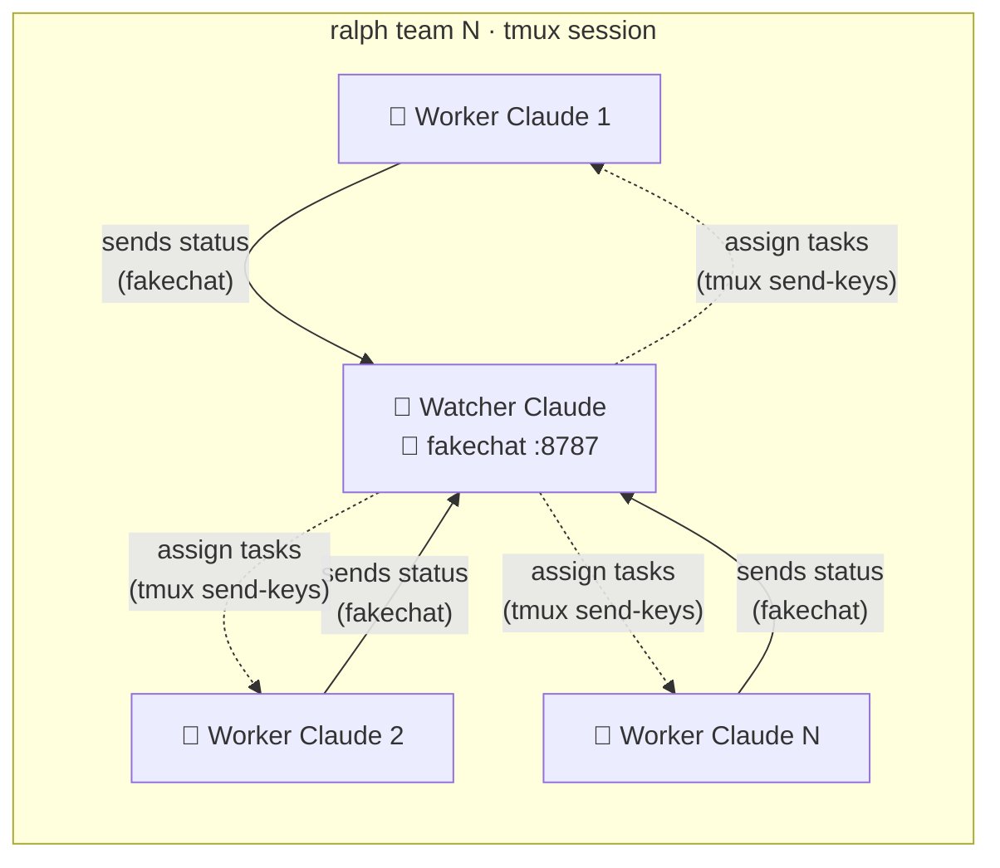

<p align="center">
  
</p>

<p align="center">
  <a href="LICENSE"></a>
  <a href="package.json"></a>
</p>

<h3 align="center">
  ralph-kage-bunshin (Ralph Wiggum 影分身) — you design, agents forge through the night.<br>
  A watcher orchestrates parallel Claude Code workers in tmux: assigns tasks, reviews code, recovers from failures — all autonomously.
</h3>

<p align="center">
  <a href="#quick-start">Quick Start</a> •
  <a href="#how-it-works">How It Works</a> •
  <a href="#commands">Commands</a> •
  <a href="#skills">Skills</a>
</p>

---

## Key Features

| Feature | Description |
|---------|-------------|
| **Watcher orchestrator** | Central Claude session manages all task assignment, worker lifecycle, and health monitoring |
| **Dynamic scaling** | Only activates worker panes when parallel tasks exist — idle panes = zero tokens |
| **Fresh sessions** | Every task assignment starts a new Claude session — no context pollution |
| **Task dependencies** | `depends_on` ensures correct ordering — watcher evaluates the dependency graph |
| **Auto-recovery** | Watcher monitors worker health, resets stuck tasks, and respawns workers |
| **Git worktrees** | `isolated: true` tasks run in dedicated branches, no file conflicts |
| **Pathology detection** | Detects stuck patterns (stagnation, oscillation, etc.) and exits cleanly |
| **Lease system** | 30-min leases prevent abandoned tasks from blocking progress |

---

## Quick Start

**1. Install**
```bash
npm install -g ralph-kage-bunshin
npx skills add dididy/ralph-kage-bunshin -gy && npx skills add dididy/e2e-skills -gy && npx skills add dididy/ui-skills -gy
```
Inside Claude Code, install the fakechat plugin:
```
/plugin install fakechat@claude-plugins-official
```

Requires: **Node.js 18+**, **tmux**, **ffmpeg**, **[Claude Code](https://claude.ai/code)**, **[Channels](https://code.claude.com/docs/en/channels)** (v2.1.80+)

> Workers and the watcher communicate via [Claude Code Channels](https://code.claude.com/docs/en/channels) using the [fakechat plugin](https://code.claude.com/docs/en/channels#quickstart).

**2. Set up your project**
```bash
cd my-project && claude
```
Inside Claude Code:
```
/ralph-kage-bunshin-start
```

**3. Launch**
```bash
ralph team 3
```

> `ralph team` spawns N empty worker panes + 1 watcher Claude session. The watcher assigns tasks to workers dynamically.

---

## How It Works



1. **Setup** — `/ralph-kage-bunshin-start` interviews you, then generates `SPEC.md`, `tasks.json`, `CLAUDE.md`
2. **Spawn** — `ralph team N` opens N empty worker panes + 1 watcher Claude pane in tmux
3. **Assign** — The watcher evaluates the dependency graph and launches Claude sessions on worker panes (`tmux send-keys`)
4. **Work** — Each worker implements its assigned task via TDD → reports `[DONE]` to watcher (`fakechat :8787`)
5. **Review** — Watcher spawns an architect on the same pane (`tmux send-keys`) → architect reports `[APPROVED]` or `[REJECTED]` (`fakechat :8787`)
6. **Recover** — On rejection, respawns the worker (`tmux send-keys`). On 3+ failures, spawns a debugger for root-cause diagnosis
7. **Complete** — When all tasks are converged, watcher sends a macOS notification and prints a summary

### Why two communication paths?

- **Watcher → Worker** (`tmux send-keys`): Watcher directly types commands into worker panes to spawn Claude sessions.
- **Worker → Watcher** (`fakechat`): Workers report results asynchronously to watcher port 8787. `tmux send-keys` can't do this — typing into the watcher's stdin while it's mid-turn would corrupt its context. fakechat via **[Channels](https://code.claude.com/docs/en/channels)** lets multiple workers report simultaneously without collision.

Tasks support `depends_on` for ordering and `isolated: true` for git worktree isolation.

---

## Commands

```
ralph team <n>              Spawn N worker panes + watcher
ralph recover               Reset expired leases, relaunch watcher
ralph status                Show worker state (one-shot)
ralph report                Per-worker summary with cost

ralph secrets set KEY=val   Store a secret in .ralph/.env
ralph secrets unset KEY     Remove a secret
ralph secrets list          List secret keys (values hidden)

ralph profile list          List available profiles
ralph profile apply <name>  Apply a profile
```

---

## Skills

Seven skills installed via [skills.sh](https://skills.sh) (see Quick Start).

| Skill | Description |
|-------|-------------|
| `ralph-kage-bunshin-start` | Dimension-based interview → SPEC.md + tasks.json (with dependency waves) + CLAUDE.md |
| `ralph-kage-bunshin-watcher` | Central orchestrator — task assignment, worker lifecycle, architect/debugger spawning, health monitoring. Per-worker summary with task, generations, time, and token cost on completion |
| `ralph-kage-bunshin-loop` | Worker execution loop: receive task → TDD → DoD → report result → exit. Delegates to `/ui-capture` for visual regression; produces skill artifacts (ui-measurements, transition-measurements) when UI tasks require them |
| `ralph-kage-bunshin-debug` | Root-cause diagnosis on 3+ failures — file:line evidence, ONE fix proposal, read-only |
| `ralph-kage-bunshin-verify` | Read-only acceptance-criteria validation — PASS/FAIL/INCOMPLETE verdict, no state changes |
| `ralph-kage-bunshin-architect` | Approval authority — spec compliance, steelman review, visual regression via `/ui-capture`, reports verdict to watcher |
| `api-integration-checklist` | Pre-coding API integration check — CORS, auth, rate limits, proxy decision |

Each skill includes behavioral evals (`evals/evals.json`) and trigger evals (`evals/trigger-eval.json`) compatible with [skill-creator](https://github.com/anthropics/skills/blob/main/skills/skill-creator/SKILL.md).

---

## Project Structure

```
.ralph/
  SPEC.md           What to build
  tasks.json        Task list with status, leases, dependencies
  .env              Secrets (gitignored, mode 0600)
  workers/
    worker-N/
      state.json              Generation, pathology flags, cost
      PROGRESS.md             Build log
      ui-measurements.json    Skill artifact (if UI task)
      transition-measurements.json  Skill artifact (if animation task)
      visual-regression.json  Screenshot comparison verdicts
      ui-capture/             /ui-capture skill artifacts (screenshots, videos, regions.json)

CLAUDE.md             TDD rules, DoD criteria
```

---

## License

Apache 2.0
